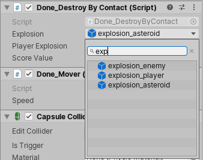

# 入门

## 安装Addressable Assets

**说明**：Addressable Asset System最低要求Unity版本为 2018.3。

具体如何安装该package，请参考 [Package Manager documentation](https://docs.unity3d.com/Packages/com.unity.package-manager-ui@1.7/manual/index.html)。

## Addressable Assets准备工作

### 设置资源为Addressable

在Unity编辑器中，有两种方式可以设置资源为Addressable：

- 在资源的Inspector中
- 在Addressables Groups窗口中

#### 在资源的Inspector中

在**Project**窗口中，选中需要设置的资源。在Inspector中选中**Addressable**复选框，然后在出现的输入框中输入一个名字作为这个资源的唯一索引标识（address）。

 

*Marking an asset as Addressable in the **Inspector** window.*

#### 在Addressables Groups窗口中

点击菜单**Window** > **Asset Management** > **Addressables** > **Groups**打开**Addressables Groups**窗口。然后把需要设置的资源从**Project**窗口拖拽到**Addressables Groups**窗口中。

 

*Marking an asset as Addressable in the **Addressables Groups** window.*

### 指定资源的索引标识（address）

项目中一个资源的默认索引标识（address）通常都是它的所在位置路径（例如：*Assets/images/myImage.png*）。你可以在**Addressables Groups**窗口中，选中一个资源，然后在右键菜单中选择**Change Address**来修改。也可以在选中资源之后，再单击一次选中的资源触发修改。

使用Addressables时，系统会把编辑时和运行时的相关配置和数据都会保存到*Assets/AddressableAssetsData*目录下的文件中。所以你需要把这个目录和目录下的文件都提交到你的版本管理中。

### 构建资源

在构建整个游戏之前，需要把资源打包到bundle中，这样游戏运行时才能使用这些资源。这一步不会在APP构建中自动执行。你可以通过Unity编辑器或者API来执行Addressables资源构建。

- 如果是使用Unity编辑器，首先打开**Addressables Groups**窗口，然后选择菜单**Build** > **New Build** > **Default Build Script**。
- 如果是使用API，可以在你的构建代码中调用[AddressableAssetSettings.BuildPlayerContent()](https://docs.unity3d.com/Packages/com.unity.addressables@1.3/api/UnityEditor.AddressableAssets.Settings.AddressableAssetSettings.html#UnityEditor_AddressableAssets_Settings_AddressableAssetSettings_BuildPlayerContent)

## 使用Addressable Assets

### 通过address加载或实例化

你可以在运行时加载或实例化一个资源。当加载一个资源时，系统会自动加载其所有的依赖资源到内存中（包括资源上的捆绑数据）。但是需要注意的是，在没有进行实例化前，加载的资源并不会出现在场景（scene）中。当然你可以使用Addressables相关的接口来加载资源，这样资源会立即出现在场景中。

在代码中加载资源，你需要申明命名空间`UnityEngine.AddressableAssets`，然后调用如下方法：

```C#
// This loads the asset with the specified address
Addressables.LoadAssetAsync<GameObject>("AssetAddress");

// This instantiates the asset with the specified address into your Scene.
Addressables.InstantiateAsync("AssetAddress");
```

**注意**：`LoadAssetAsync`和`InstantiateAsync`都是异步操作。你需要提供一个回调，它会在资源加载完成后被调用。具体可查看文档**Async operation handling**，示例代码如下：

```C#
using System.Collections;
using System.Collections.Generic;
using UnityEngine.AddressableAssets;
using UnityEngine;

public class AddressablesExample : MonoBehaviour {

    GameObject myGameObject;

        ...
        Addressables.LoadAssetAsync<GameObject>("AssetAddress").Completed += OnLoadDone;
    }

    private void OnLoadDone(UnityEngine.ResourceManagement.AsyncOperations.AsyncOperationHandle<GameObject> obj)
    {
        // In a production environment, you should add exception handling to catch scenarios such as a null result.
        myGameObject = obj.Result;
    }
}
```

#### 子资源和components

子资源和components在资源加载中有一些特别之处。

##### Components

当然你不可以直接通过Addressables来加载一个GameObject上的component。你必须加载和实例化得到GameObject之后，才能获得component的引用。如果你想知道怎么扩展Addressables来支持component加载，你可以参看我们的示例项目[ComponentReference](https://github.com/Unity-Technologies/Addressables-Sample/tree/master/Basic/ComponentReference)。

##### 子资源

如果你想加载子资源，只需要指定一些特殊的加载参数即可。我们提供了一个从图集中加载图片，或从FBX文件中加载一个动画的示例[sprite loading](https://github.com/Unity-Technologies/Addressables-Sample/tree/master/Basic/Sprite Land)。

关键代码如下：

```C#
// To load all sub-objects in an asset
Addressables.LoadAssetAsync<IList<Sprite>>("MySpriteSheetAddress");

// To load a single sub-object in an asset
Addressables.LoadAssetAsync<Sprite>("MySpriteSheetAddress[MySpriteName]");
```

在**Addressables Groups**窗口中，所有的资源名称都可以看到，包括子资源。

### 使用AssetReference

使用AssetReference，你不需要知道资源的具体address，只需要在脚本中引用一个资源即可：

1. 在**Hierarchy**窗口或者**Project**窗口中选中一个资源。

2. 在**Inspector**窗口中点击**Add Component**，选择Component类型。任何可序列化component都支持AssetReference变量（例如：Mono脚本，ScriptableObject，或其他可序列化类）。

3. 在这个脚本中添加一个公有的AssetReference属性（例如：public AssetReference explosion;）。

4. 在**Inspector**窗口中可以选择一个Addressable资源绑定到这个AssetReference属性上，或者从**Project**窗口拖拽到这个属性上，如下图：

    

   *Referencing an Addressable Asset via script component.*

然后在代码中可以通过对应的方法加载或实例化一个资源，代码如下：

```C#
AssetRefMember.LoadAssetAsync<GameObject>();

AssetRefMember.InstantiateAsync(pos, rot);
```

##### 子资源

如果一个包含了子资源的资源（比如说SpriteAtlas或FBX）添加到AssetReference，你可以选择资源本身，或者也可以选择对应的子资源。在属性后面会出现两个下拉框，第一个是选择资源本身，第二个是选择子资源。如果第二个下拉框选择**none**则代表使用默认的主资源。

## 构建注意事项

### StreamingAssets中的本地数据

Addressable Asset System在运行时，需要通过一些必要的文件才能知道资源加载时，需要从哪些资源文件中和如何加载。在构建Addressables时，这些文件会生成在**StreamingAssets**目录下。这个特殊的目录下所有的文件都会打包到APP中。构建资源时，系统会把这些文件缓存在**Library**目录下。然后在构建APP时，再把这些文件拷贝覆盖到**StreamingAssets**目录下，然后删除**Library**目录下的文件。所以当APP发布到不同的平台时，它们只会包含跟各自平台相关的数据。

除了特定的Addressables数据之外，每个资源组构建后的数据都会缓存在所设定平台特有的位置。为了确保有效，需要在**Profile**属性中设置构建路径（以`[UnityEngine.AddressableAssets.Addressables.BuildPath]`开头）和加载路径（以`{UnityEngine.AddressableAssets.Addressables.RuntimePath}`开头）。你可以在**AddressableAssetSettings**（默认该文件是在*Assets/AddressableAssetsData*目录下）的**Profile**属性中管理这些配置。

### 预下载

可以调用`Addressables.DownloadDependenciesAsync()`，并指定address或label下载相关联的依赖资源。通常下载下来的是asset bundle文件。

在接口返回的`AsyncOperationHandle`结构中包含了属性`PercentComplete`，你可以监听这个值来显示下载进度。你也可以让你的APP一直等待，直到所有文件都下载完毕。

#### 关于`PercentComplete`

`PercentComplete`只是考虑了单个`AsyncOperationHandle`一些内部处理情况。所以在某些情况下，它并不是线性的，也有可能是线性的。这都是由哪些快速操作或者那些同样需要长时间处理的操作的权重决定的。

例如，你想从远端下载一个资源，可能需要花费大量的时间，但是它的依赖资源已经存在于本地，所以你会发现在开始下载时，`PercentComplete`就跳到了50%。这是因为资源在本地加载要比从远程加载快得多，而且这一步操作只需要两步就完成了。

如果你希望在下载前得到用户的同意，请使用`Addressables.GetDownloadSize()`来返回从给定address或label下载内容所需的空间。注意，这将考虑到所有以前下载的仍然在Unity的资产包缓存中的包。

虽然预下载是有好处的，但是在某些情况下，或许不是一个好的选择，例如：

- 如果你的APP有大量的在线资源，但是你通常只期望用户只与其中一少部分有交互。
- 你的APP必须联网，而且你的资源都是非常小的包，最好是按需下载。

比起只是使用一个百分比数字来等待下载完成，最好是使用一个预加载功能来展示下载开始和下载进度。这需要你来实现一个加载或等待界面，显示在资源还未被加载完成的时候。

### 跨平台构建

Addressable Asset System会打包所有Addressables资源。Asset bundles是平台依赖的，所以每一个平台都需要重新构建。

默认情况下，当构建完毕后，构建后的文件数据都会根据平台保存到build path对应的平台子目录下，运行时根据这些平台目录来访问对应的资源。

**注意**：在编辑器下运行时，并使用`BuildScriptPackedPlayMode`，Addressables会为你当前选定的平台加载资源数据。如果你当前资源的构建平台和编辑器选定的平台不相符，有可能会出现错误和异常。你可以查看文档**Play mode scripts**获取更多相关信息。

### 资源分组

好的做法是把资源分散到不同的组中，而不是把他们放在一个大大的资源组中。主要的好处就是避免在多个合作者在修改同一文件而导致版本管理系统出现冲突。只有一个很大的资源组可能导致无法在版本管理系统中完整地合并这些修改。

### 把场景打包在一起

如果你的某个资源组中有多个场景，在你打包资源的时候，这些场景会相互依赖，如果这样：

- 在**Project**窗口的`Packed Assets`下，资源组的**Bundle Mode**属性为**Pack Together**。
- 资源组的场景拥有同样的label，并且资源组的**Bundle Mode**属性为**Pack Together**。

如果你修改了资源组中任意一个场景，然后运行**content update build**，那么所有相互依赖的场景都会被移动到一个新的**Content Update group**中。

### Content Catalog加载

Content Catalog存储了Addressables查找资源实际位置相关数据。默认下，Addressables会为本地的资源组生成catalog。如果在`AddressableAssetSettings`中的**Build Remote Catalogs**启用了，系统会为远程的资源组生成一个额外的catalog。Addressables只会使用其中一个catalog，如果远程有一个catalog和本地的hash串有差异，那么远程的catalog会被下载，并缓存下来代替本地的catalog。

但是，如果可能的话，你期望加载指定的catalog，可能会有不同的原因需要加载额外的catalog，比如构建一个只有美术资源的项目提供给其他项目使用。

如果找到一个适合你的catalog，可以使用`LoadContentCatalogAsync`来加载它。

只要知道catalog的位置，就可以使用`LoadContentCatalogAsync`来加载。但是，这种做法并没有使用catalog缓存。所以需要注意的是，想要加载一个远程的catalog，那么就需要每次都通过`WebRequest`来加载那个需要的catalog。

为了避免每次都需要下载远程的catalog，需要提供一个`.hash`文件和你的catalog一起被加载。AAS可以利用它来缓存catalog。

**注意**：这个hash文件需要和catalog在同一个远程位置，然后文件名要和catalog一致。他们的路径只有文件后缀不一样。

还需要注意的是，你会注意到这个方法有一个参数`autoReleaseHandle`。在下载一个新的远程catalog之前，任何之前调用`LoadContentCatalogAsync`加载的catalog都必须要释放。否则，系统会选择这个已经被加载的catalog作为缓存。如果系统选择缓存的catalog，那么远程的catalog就不会被下载。如果`autoReleaseHandle`设置为true，就可以确保加载的catalog完成后不会保持在缓存中。

